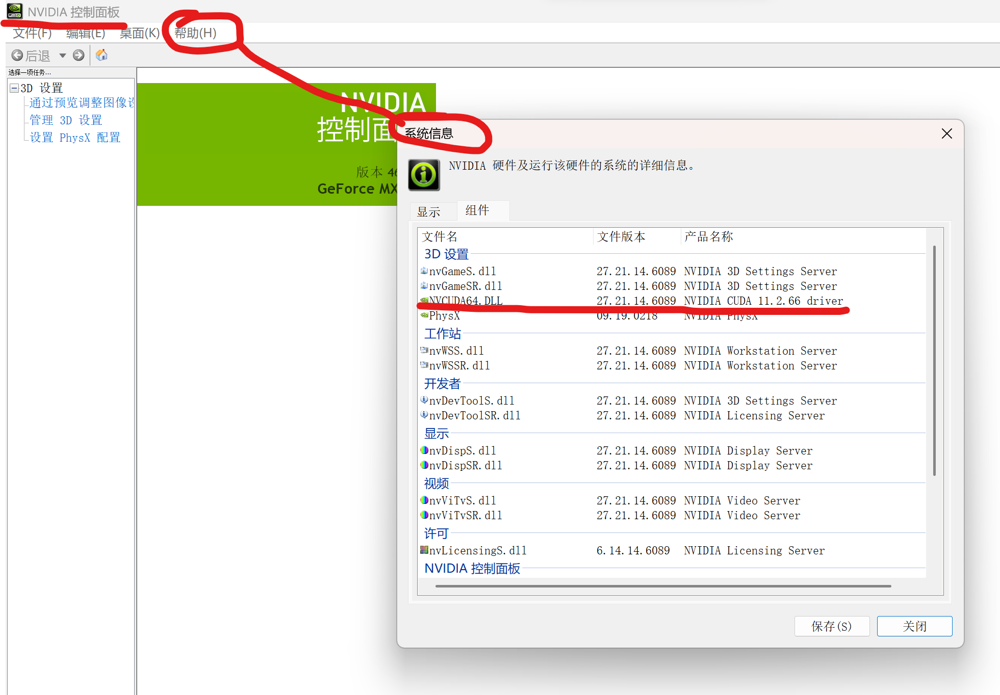
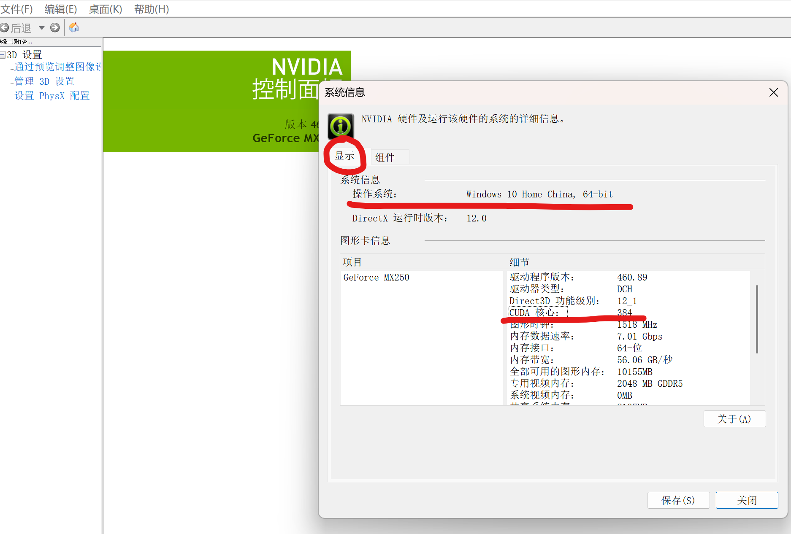
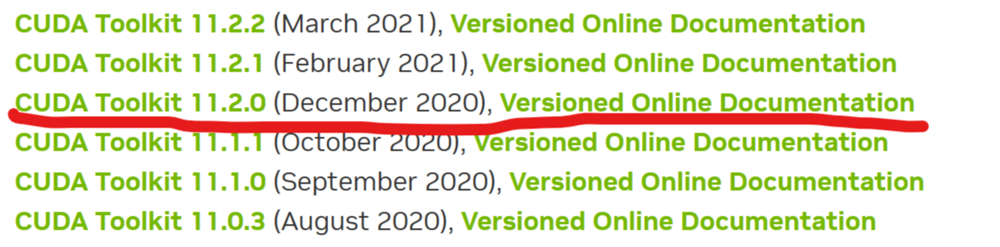
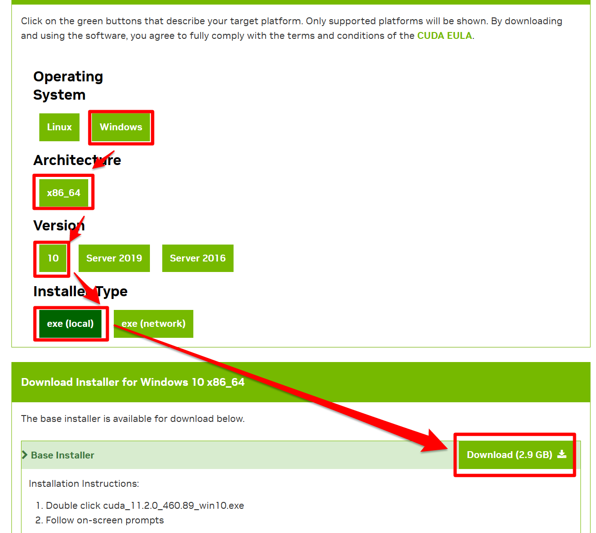
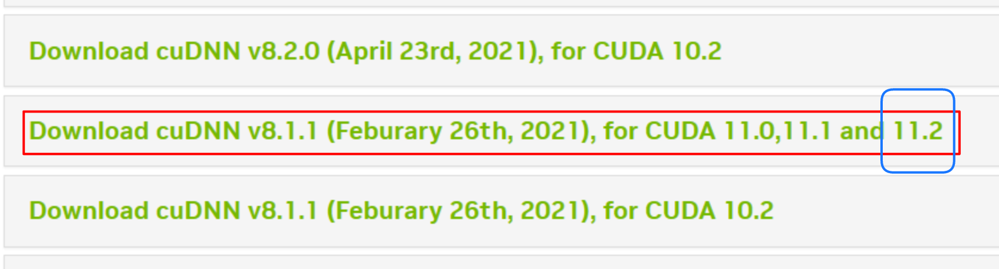
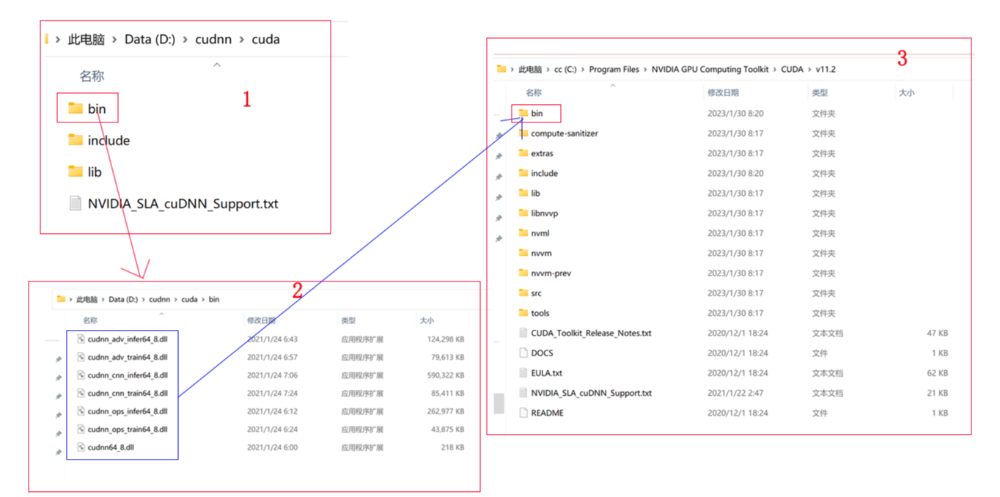

> 需要安装python、cuda、cudnn、tensorflow、pytorch，根据对应关系确定要下载的版本型号。以上均为GPU版本。

[tensorflow和cuda、cudnn、python版本之间的匹配关系参考](https://www.tensorflow.org/install/source_windows?hl=zh-cn)

[pytorch和cuda、python版本对应关系](https://pytorch.org/get-started/previous-versions/)

# 检查电脑环境

#### 1.python版本

直接安装的python3.9，没有使用anaconda，没有创建虚拟环境。

#### 2.cuda版本

我的电脑是11.2版本的cuda，面板信息显示如下：

#### 3.系统版本

查看电脑的系统，我用的是win11系统，但是NVIDIA面板显示的是win10，所以选择版本的时候按win10选择的。

# 安装cuda

#### 1.下载cuda版本

[CUDA 下载地址](https://developer.nvidia.com/cuda-toolkit-archive)

#### 2.安装cuda

按照提示下一步安装即可，保持默认目录（C:\Program Files\NVIDIA GPU Computing Toolkit\CUDA），安装过程中提示没有vs编译，继续安装完成。

# 安装cudnn

#### 1.下载cudnn版本

[cuDNN 下载地址](https://developer.nvidia.com/rdp/cudnn-archive)，版本与CUDA版本11.2对应，点进去之后选择windows版本。

#### 2.安装cudnn

解压下载好的文件，将以下文件夹（bin、include、lib）内的所有内容，复制到cuda安装目录下对应文件夹内。注意：非覆盖对应文件夹

# 安装tensorflow-gpu

#### 1.安装

~~~python
pip install tensorflow-gpu==2.6.0
~~~

#### 2.测试

~~~python
import tensorflow as tf
>>>print(tf.__version__)
>>print(tf.config.list_physical_devices('GPU'))
[PhysicalDevice(name='/physical_device:GPU:0', device_type='GPU')]
~~~

# 安装pytorch

#### 1.安装

~~~python
pip install torch==1.11.0+cu113 torchvision==0.12.0+cu113 torchaudio==0.11.0 --extra-index-url https://download.pytorch.org/whl/cu113
~~~

我这块下载的是cuda11.3的版本，与我的11.2没有完全对应，是因为没找到cuda112的版本，还好安装下来没有出问题也可以下载使用wheel文件，[下载地址](https://download.pytorch.org/whl/torch_stable.html)

#### 2.测试

~~~python
>>> import torch
>>> print(torch.cuda.is_available())
True
~~~

